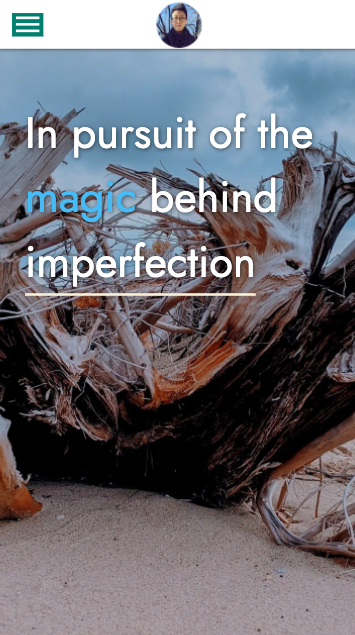

# Portfolio

## Project overview

This portfolio showcases recent projects and respective deployment/github links, as well as a peak at a few projects that I am proud of. Different methods of contact are also provided for future work endevors and collaborations.

### Project Status:

This application is a work in progress as I add to my repositories and projects as a budding full-stack web developer. Please check back often to see updates and additions.

#### Issues to debug:
* rendering cards to be same size
* figuring out Materialize and perhaps exploring another library

****

### Project-build Aspects:

The following components are used to build the code for this project:

1. **HTML**
2. **CSS**:
    - Materialize
    - Google Fonts
    - custom
3. **JavaScript**:
    - Vanilla JavaScript
    - Materialize

### Functionality:

The following lists all functions within this project:

* navbar fixed for UI/UX funcionality
* displayed project screenshots with interactive information and links
* mobile-friendly and responsive with media query
    - navbar hamburger menu: displays side navbar on click
    - shuffles project cards
    - responsive font size

****

## Installation

1. Clone this repository onto local workspace
2. Open Terminal (MacOS) or Git Bash (Windows) and change location to where you want the cloned directory
3. Type `git clone` and paste copied respository
4. Directory should include the following:
    * assets folder
        - images folder
        - PDF folder
        - javascript folder: `script.js`
        - css folder: `style.css`
    * `index.html`
    * `README.md`
    * `.gitignore` file

### Portfolio screenshot

Screenshots of mobile-friendly navigation bar:

 

Screenshot of widescreen monitor:

****

## Deployment

Please use the following link to deploy a live URL of this project:

[Pamela Hsu || Fullstack Web Developer](https://p-hsu.github.io/portfolio-p.hsu/)

****

## Credit

* [Materialize](https://materializecss.com/) documentation for CSS and JavaScript
* [Google Fonts](https://fonts.google.com/)
* [GitHub](https://github.com/logos) logo
* [LinkedIn](https://brand.linkedin.com/downloads) logo
* Full-stack Bootcamp Program @ [Washington University, Saint Louis](https://bootcamp.tlcenter.wustl.edu/) through [© 2021 Trilogy Education Services, LLC, a 2U, Inc. brand](https://www.trilogyed.com/)

